# 🍜 Warkopmindo 43
### Sistem Pemesanan Makanan Berbasis Web Menggunakan Laravel

## 📖 Deskripsi Aplikasi

Warkopmindo 43 merupakan aplikasi pemesanan makanan berbasis web yang dikembangkan menggunakan framework Laravel. Aplikasi ini dirancang untuk mempermudah proses pemesanan makanan di Warmindo dengan memanfaatkan QR Code sehingga pelanggan dapat langsung melihat menu, melakukan pemesanan, memilih metode pembayaran, serta memantau status pesanan secara online.

Aplikasi ini menerapkan konsep **Multi-Role Authentication** yang terdiri dari tiga role utama, yaitu **Admin**, **Kasir**, dan **Customer** sehingga setiap pengguna memiliki hak akses sesuai tugas dan tanggung jawabnya.

---

# 👨‍💻 Anggota Kelompok

| No | Nama | NIM | Tugas |
|----|------|------------|--------------------------------------------------------------------------|
| 1 | Mochammad Alfan Ridho Kurniawan | 202359201015 | Pengembangan Fitur Customer (Halaman Menu, Detail Menu, Keranjang, Checkout, Pembayaran, dan Tracking Pesanan) |
| 2 | Yorentiana Rafu | 202359201030 | Pengembangan Fitur Admin dan Backend (Dashboard Admin, Manajemen Menu, Manajemen Kategori, Logika Bisnis, dan Integrasi Data) |
| 3 | Maria Santia Moruk | 202359201019 | Pengembangan Fitur Kasir (Dashboard Kasir, Manajemen Pesanan, Pembayaran, dan Perubahan Status Pesanan) |
| 4 | Gregorius Rio Putra | 202359201038 | Dashboard Statistik, QR Controller, Report Controller, Penyusunan README.md, dan Perancangan User Flow |

---

# 🎯 Tujuan Aplikasi

Aplikasi ini dibuat untuk membantu proses pemesanan makanan menjadi lebih cepat, efisien, dan praktis dengan memanfaatkan teknologi QR Code sehingga pelanggan tidak perlu lagi memanggil pelayan untuk melakukan pemesanan.

---

# 🛠️ Teknologi yang Digunakan

- Laravel
- PHP
- SQLite Database
- Bootstrap 5
- Blade Template Engine
- HTML5
- CSS3
- JavaScript
- Git
- GitHub

---

# 👥 Hak Akses (Role)

## 1. Admin

Admin memiliki hak akses untuk:

- Login ke sistem
- Mengelola Dashboard
- Mengelola Data Menu
- Menambah Menu
- Mengubah Menu
- Menghapus Menu
- Mengelola Data Kategori
- Melihat seluruh data pesanan
- Mengakses Dashboard Statistik
- Mengakses Laporan

---

## 2. Kasir

Kasir memiliki hak akses untuk:

- Login
- Melihat pesanan customer
- Memproses pesanan
- Mengubah status pesanan
- Melihat riwayat pesanan
- Mengelola pembayaran customer

---

## 3. Customer

Customer dapat:

- Scan QR Code
- Melihat daftar menu
- Mencari menu
- Filter menu berdasarkan kategori
- Melihat detail menu
- Menambahkan menu ke keranjang
- Mengubah jumlah pesanan
- Menghapus menu dari keranjang
- Checkout
- Memilih metode pembayaran
- Melihat QRIS
- Melihat tracking pesanan

---

# ⚙️ Instalasi Aplikasi

## 1. Clone Repository

```bash
git clone https://github.com/Rentiii612/UASwarmindo.git

```

Masuk ke folder project

```bash
cd warmindo1
```

---

## 2. Install Dependency

```bash
composer install
```

Jika project menggunakan Vite:

```bash
npm install
```

---

## 3. Konfigurasi Environment

Copy file environment

```bash
cp .env.example .env
```

Generate application key

```bash
php artisan key:generate
```

---

## 4. Konfigurasi Database

Aplikasi menggunakan SQLite.

Buat file database:

```bash
database/database.sqlite
```

Atur file `.env`

```env
DB_CONNECTION=sqlite
```

---

## 5. Migrasi Database

```bash
php artisan migrate
```

Apabila tersedia Seeder:

```bash
php artisan db:seed
```

atau

```bash
php artisan migrate:fresh --seed
```

---

## 6. Menjalankan Aplikasi

```bash
php artisan serve
```

Aplikasi akan berjalan pada:

```
http://127.0.0.1:8000
```

---

# 🔐 Akun Demo

## Admin

Email

```
admin@warmindo.com
```

Password

admin123


---

## Kasir

Email

```
kasir@warmindo.com
```

Password

```
12345678
```

---

# 📱 Panduan Penggunaan Aplikasi

## A. Customer

### Langkah 1

Customer melakukan **scan QR Code** yang tersedia pada meja.

↓

### Langkah 2

Customer otomatis diarahkan ke halaman daftar menu.

↓

### Langkah 3

Customer dapat:

- Melihat daftar menu
- Mencari menu
- Memilih kategori
- Melihat detail menu

↓

### Langkah 4

Customer menambahkan menu ke keranjang.

↓

### Langkah 5

Customer membuka halaman keranjang.

Pada halaman ini customer dapat:

- Mengubah jumlah pesanan
- Menghapus menu
- Melihat total pembayaran

↓

### Langkah 6

Customer memilih Checkout.

↓

### Langkah 7

Customer mengisi:

- Nama
- Nomor Meja
- Catatan (Opsional)

↓

### Langkah 8

Customer memilih metode pembayaran

- Cash
- QRIS

↓

### Langkah 9

Pesanan berhasil dibuat.

↓

### Langkah 10

Customer membuka halaman Tracking untuk melihat perkembangan pesanan.

Status pesanan:

- Pending
- Diproses
- Siap
- Selesai

---

## B. Admin

### Langkah 1

Login ke sistem.

↓

### Langkah 2

Masuk Dashboard.

↓

### Langkah 3

Mengelola Data Menu

- Tambah
- Edit
- Hapus

↓

### Langkah 4

Mengelola Data Kategori

↓

### Langkah 5

Melihat seluruh data pesanan.

↓

### Langkah 6

Melihat Dashboard Statistik.

↓

### Langkah 7

Melihat Report.

---

## C. Kasir

### Langkah 1

Login.

↓

### Langkah 2

Melihat daftar pesanan customer.

↓

### Langkah 3

Melakukan proses pembayaran.

↓

### Langkah 4

Mengubah status pesanan.

Urutan status:

```
Pending

↓

Diproses

↓

Siap

↓

Selesai
```

↓

### Langkah 5

Riwayat pesanan tersimpan.

---

# 📊 User Flow

## Customer

```
Scan QR
      │
      ▼
Halaman Menu
      │
      ▼
Pilih Menu
      │
      ▼
Keranjang
      │
      ▼
Checkout
      │
      ▼
Cash / QRIS
      │
      ▼
Pesanan Dibuat
      │
      ▼
Tracking Pesanan
      │
      ▼
Pesanan Selesai
```

---

## Admin

```
Login
   │
   ▼
Dashboard
   │
   ▼
Kelola Menu
   │
   ▼
Kelola Kategori
   │
   ▼
Melihat Pesanan
   │
   ▼
Dashboard Statistik
   │
   ▼
Report
```

---

## Kasir

```
Login
   │
   ▼
Pesanan Masuk
   │
   ▼
Proses Pembayaran
   │
   ▼
Update Status Pesanan
   │
   ▼
Pesanan Selesai
```

---

# 📁 Struktur Project

```
app/
bootstrap/
config/
database/
public/
resources/
routes/
storage/
```

---

# 📸 Screenshot Aplikasi dan Dokumentasi Aplikasi

## Halaman Akses Customer

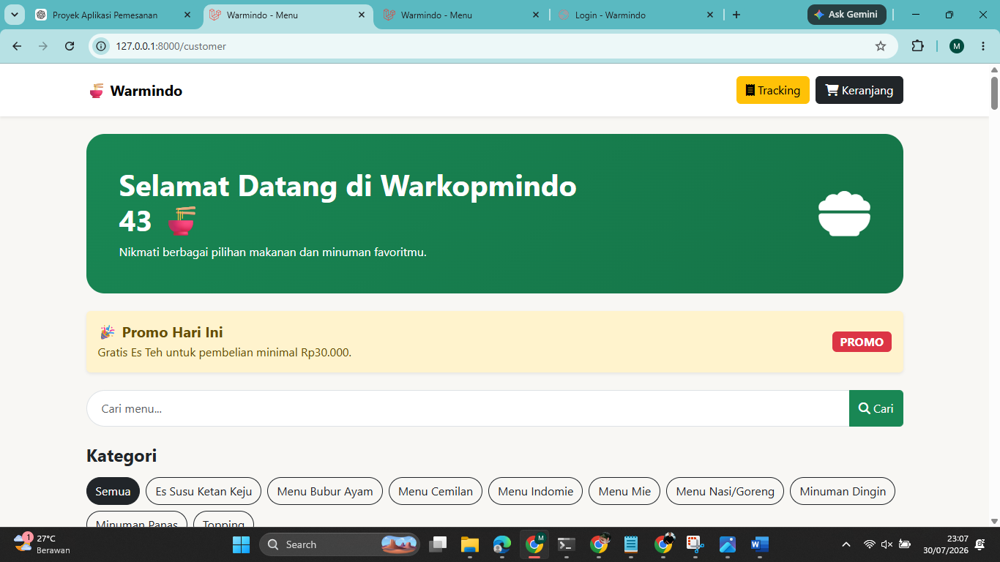

---

## Dashboard Admin

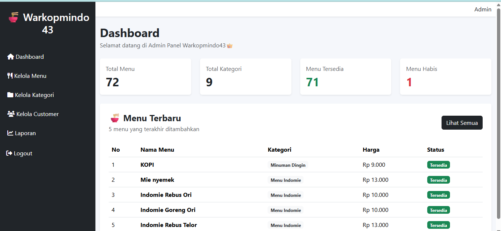

---

## Dashboard Kasir

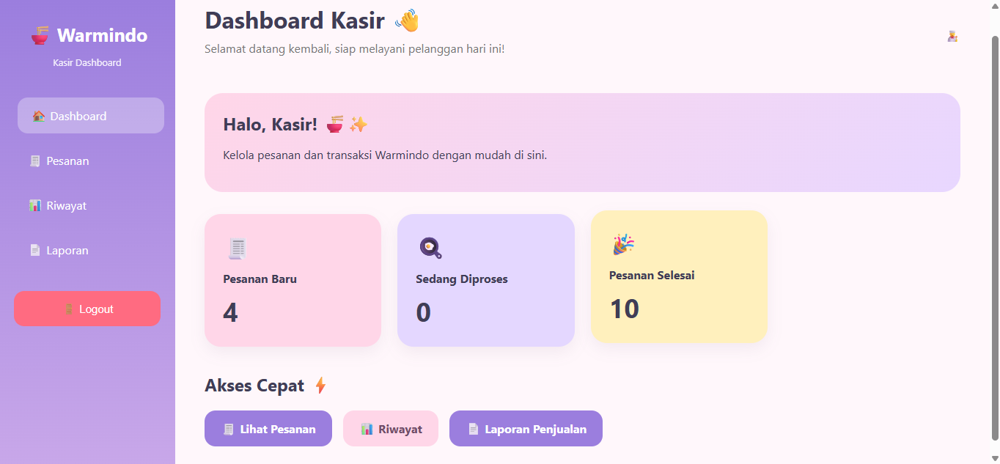

---

## Halaman Login

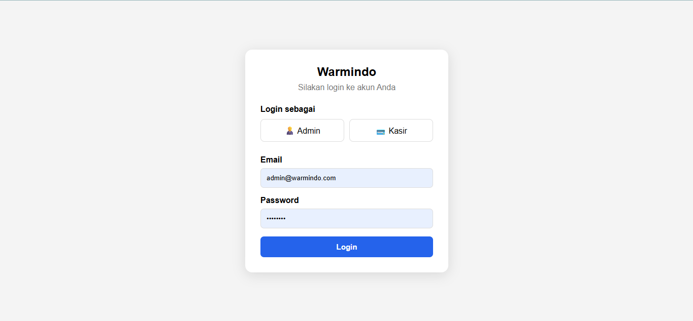

---

## Kelola Menu

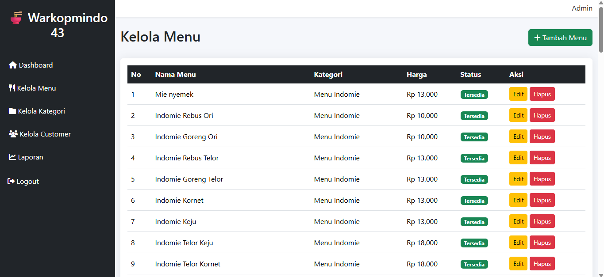

---

## Kelola Kategori

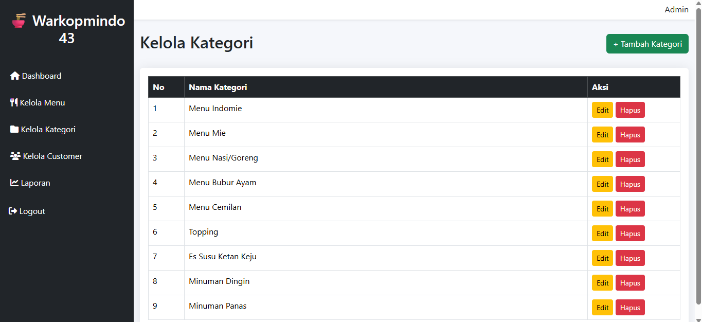

---

## Daftar Pesanan

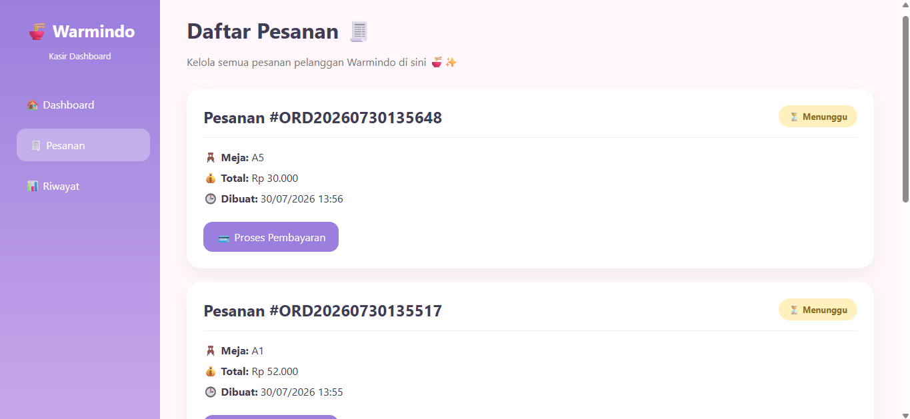

---

## Laporan Admin

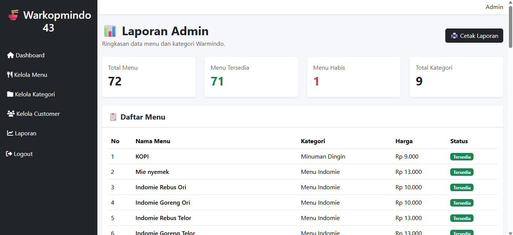

---

## Laporan Penjualan Kasir

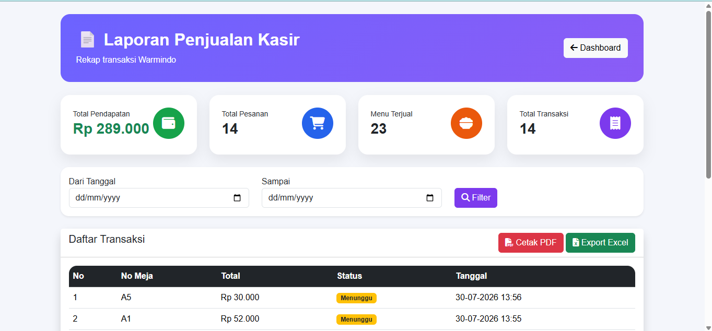

## Userflow Aplikasi  
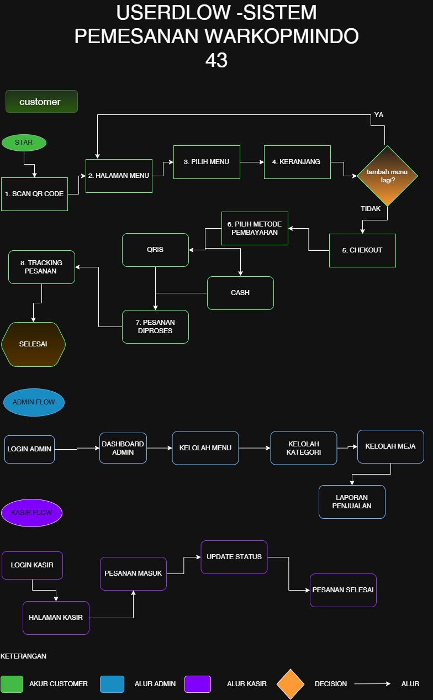

## Dokumentasi Pengerjaan Aplikasi 
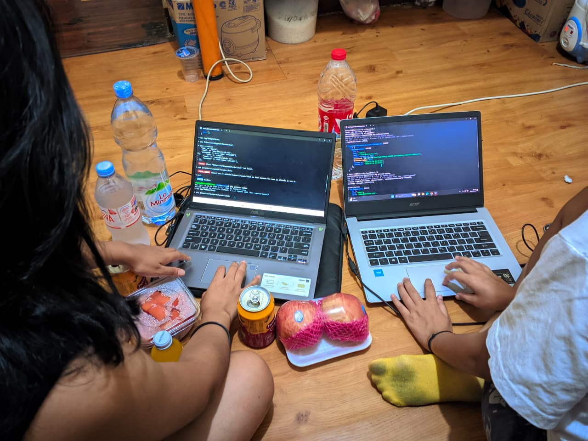
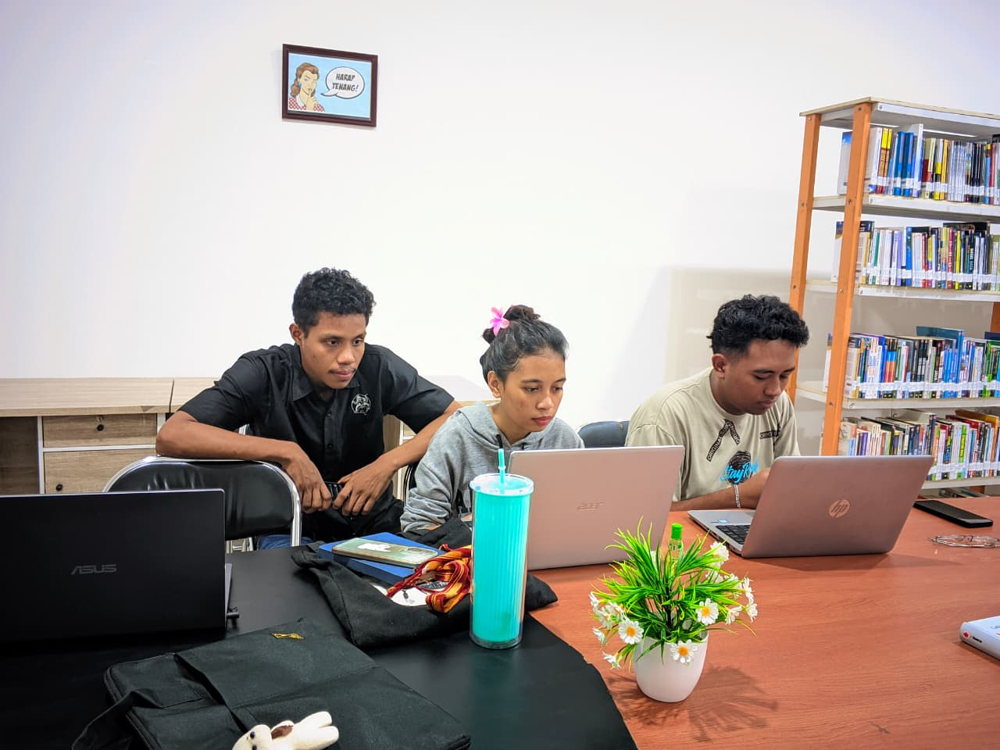
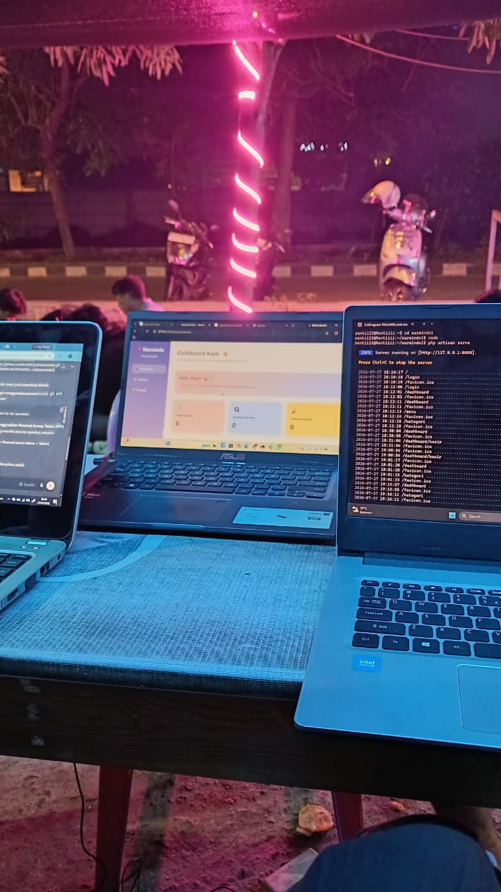

---

# 📌 Catatan

- Menggunakan Laravel sebagai framework utama.
- Menggunakan SQLite sebagai database.
- Menggunakan Git dan GitHub sebagai version control.
- Menggunakan Middleware untuk membatasi hak akses berdasarkan role.
- Menggunakan Migration untuk membangun struktur database.

---
#Link Repository (https://github.com/Rentiii612/UASwarmindo.git)
# 📄 Lisensi

Project ini dikembangkan sebagai **Proyek Akhir Semester (UAS)** Mata Kuliah **Pemrograman Web II** Program Studi Teknologi Informasi.

Seluruh source code pada repository ini dibuat untuk keperluan akademik.